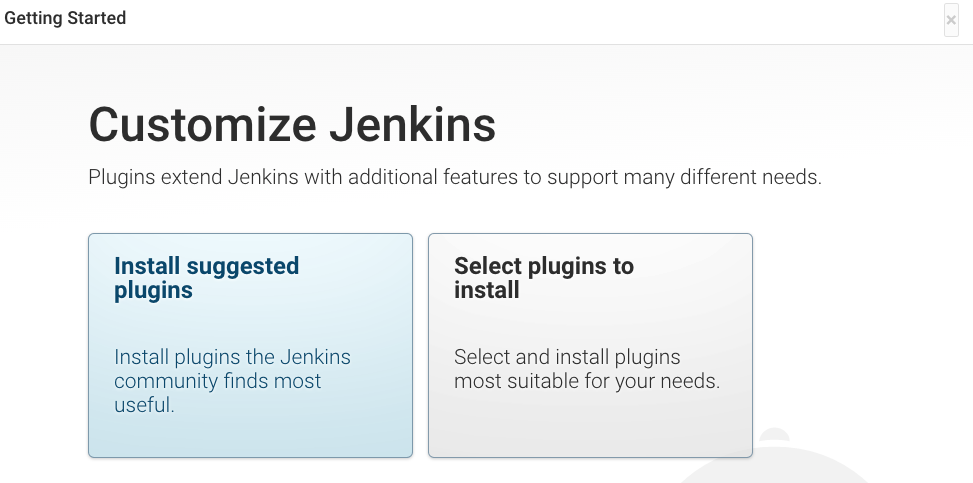

# jenkins-host-to-cloud
Work-in-progress project aiming to aid migration from a Jenkins server to cloud hosting (AKS and EKS). Consuming a configuration yaml file, the tool generates a Dockerfile to containerize the Jenkins server, and Kubernetes manifests to create the supporting resources. 

Future goals include automated assistance to transition Jenkins configuration from web UI to Jcasc, and Job/Pipeline configuration to yaml with [Jenkins Job Builder](https://jenkins-job-builder.readthedocs.io/en/latest/).

Sister project to create K8s cloud infrastructure to run Jenkins (Currently only AKS support) [Mu-Nirvana/jenkins-cloud-create](https://github.com/Mu-Nirvana/jenkins-cloud-create)

## Project structure

* [test](test) Contains test cases for different Jenkins server configs
  * [test/Base_container](test/Base_container)  Is a basic Jenkins docker container with no configuration predefined
  * [test/Copy_container](test/Copy_container)  Is a Jenkins docker container built using a direct copy of another Jenkins server jenkins_home directory
  * [test/Autogenerate_container](test/Autogenerate_container) Is a docker container built automatically from a copied Jenkins_server
* [src](src) Contains source code for the tool
	* The main script for the tool is located at [src/jenkins_generator.py](src/jenkins_generator.py)
	* [src/example_files](src/example_files) contains example configuration files
	* [src/templates](src/templates) contains the base templates used by the tool to generate the files

## Jenkins Generator instructions
### Usage
`$ ./jenkins_generator.py [OPTION] [FILE]`
If the config file is located in the current directory and using the default name `config.yaml`, `[FILE]` can be omitted.
### Options
* `--help` - Prints help output similar to these docs
* `--no-build` - Overrides config and disables the build step
* `--no-run` - Overrides config and disables the run step
* `--out=<modes>` - Overrides config and sets the passed output modes
	* `<modes>` should be a comma separated list with no spaces
* `--suggested` - Enables suggested commands output. (Not Yet Implemented)
* `--tls-cert=<type>` - Overrides config and sets tls cert type. (Currently only `none` is supported)
## Config yaml
The program defaults to searching the current directory for `config.yaml` if no config file is passed to the command.
### Sections
There are up to five distinct sections to the config yaml.
1. [`JenkinsGenerator`](#jenkinsgenerator)- This section specifies configuration options for the tool - **required*
2. `Dockerfile` - This section specifies key values and configuration for Dockerfile generation - **Optional*
3. `K8s` - This section specifices key values and configuration for kubernetes generation - **Optional*
4. `Build` - This section specifies build configuration for docker - **Requires* `Dockerfile`
5. `Run` - This section specifies run configuration for docker - **Requires a tagged image*

For further detail of sections view [src/example_files/example_config.yaml](src/example_files/example_config.yaml)
Additional key values for custom or modified templates can be added to the Dockerfile and K8s sections. In template files key names are substituted with the form `${KEY}`. Keys in sub dictionaries to the `Dockerfile` or  `K8s` section can be specified with `${subdict.KEY}`.

### JenkinsGenerator
No options are required, all will fill from defaults. Most can be overrided from the [cli](#options)
* `output` - Comma separated list of output modes - defaults to `stdout	`
	* Modes - `stdout`, `files`, `tar`, and `all`
* `templates` - Dictionary of additional/overridden template files - defaults to `default`
	* `templates: default` uses defaults.
	* Built in templates for overriding are `Dockerfile`, `K8sTLS_Secret`, `AzureK8sPVC`, `K8sDeployment`, and `K8sNet`
	* Additional templates specified prefixed with `K8s` will be built as Kubernetes manifests
* `suggested` - Set suggested command output - defaults to `No`
	* Feature not yet implemented, `Yes` has no effect
* `TLSCert` - Set TLSCert generation mode - defaults to `none`
	* Modes are `none` (`file` and `secret` coming soon)

## Building the docker image and setting up kubernetes
A few additional steps and commands are required to start Jenkins from the Dockerfile and Kubernetes manifests.
### Docker build
`docker build [OPTIONS] -t <name>:<tag> .` to build image from Dockerfile
* `--rm` option helps keep docker workspace clean
* `<name>` should include the container registry name if using one. ([Docker registries and pushing images](https://docs.docker.com/engine/reference/commandline/push/))

### Kubernetes apply
`kubectl apply -f '*K8s*.yaml'` create kubernetes resources on cluster

### Ingress controller
**For azure:**
**replace* \<DNS prefix>
```
helm upgrade --install ingress-nginx ingress-nginx \
  --repo https://kubernetes.github.io/ingress-nginx \
  --namespace ingress-nginx \
  --create-namespace \
  --set controller.service.annotations."service\.beta\.kubernetes\.io/azure-dns-label-name"=<DNS prefix> 
  --set controller.service.externalTrafficPolicy=Local
  ```
### Jenkins Kubernetes intialization
The Jenkins deployment begins with an init container to allow setup of the jenkins_home directory.
`kubectl get pods` to get jenkins pod name.
`kubectl cp <local-jenkins-home-tar/directory>  <jenkins-pod>:/mnt/jenkins-volume -c init`
**To finish setup within pod:**
* `kubectl exec <jenkins-pod> -c init -it -- bash` to login to container
* Finish any additional setup and run `touch /mnt/jenkins-volume/done` to exit container and start jenkins

**Otherwise:**
`kubectl exec <jenkins-pod> - c init -- touch /mnt/jeknins-volume/done` to finish init and start jenkins

## Copying a jenkins instance
### Copy jenkins home
*On target jenkins instance* run these commands to create the copy. Copy the resulting the files to the build machine.
#### Create archive
`$ tar -czf --exclude='/var/jenkins_home/plugins' jenkins_home.tar /var/jenkins_home` (jenkins_home may be at another location or stored in `$JENKINS_HOME`  
**If the jenkins home directory is not named jenkins_home** do the following instead:  
`$ tar -czf --exclude='<dir name>/plugins' jenkins_home.tar --transform s/<dir name>/jenkins_home/ <dir name>` Note: use `-s /^<dir name>/jenkins_home/` if using BSD tar instead of GNU
#### Create dependency list
Automatically:
`$ apt list --manual-installed=true > targetdeps.txt`

A short list of dependencies can be made by hand to greatly reduce unneeded dependencies and image size.

## Basic process to launch Jenkins test environments

1. cd [test/Base_container](test/Base_container)

2. Build and Run the Jenkins image:
`$ make`

3. Check container health:
`$ docker ps`

4. Login to container at `https://localhost:{HOST_PORT}`

5. Once Jenkins has finished starting login with the password attained by running the command:
`$ docker container exec basejenkins cat /var/jenkins_home/secrets/initialAdminPassword` (Replace basejenkins with copyjenkins as needed)

6. Simply `x` out of plugin setup for this test case & start using Jenkins:
   
7. Have fun

Note: For [test/Copy_container](test/Copy_container) testing, you require a tar file of Jenkins home directory to test your migration.

## Make Specifics

### Build
`$ make build`: Builds only the image

### Run 
`$ make run`: Runs the container without building the image

### Clear
`$ make clear`: Removes all images and artifacts

### Clean (Copy_container only)
Used internally to remove artifacts after build

### Extract (Copy_container only)
Used internally to extract files from archive

### Variables
`BUILDOPTIONS:=--rm` Specify options for docker build
`RUNOPTIONS:=--restart=on-failure --detach` Specify options for docker run
`TAG:=test_base` Image tag (test_copy for Copy_container)
`CONTAINER:=basejenkins` Container name (copyjenkins for Copy_container)
`IP:=127.0.0.1` Jenkins publish IP
`PORT:=`Jenkins Publish Port
`EXTRACT:=~/Downloads/jenkins_home.tar` jenkins_home archive path (Copy_container only)

Overwrite variables with the following syntax: `$ make \<var>=\<value>`

##  Build and run Auto-generate environment
[test/Autogenerate_container](test/Autogenerate_container) 

### Build and start container
`$ ../../src/jenkins_generator.py example_copy.yaml`

## Helpful commands

### Stop container
`$ docker stop <container name>`

### Start container
`$ docker start <container name>`

### Shell into container
`$ docker container exec -it <container name> /bin/bash`
Optionally add `-u root` before `-it` to gain root privileges

### List pods
`$ kubectl get pods` 
Optionally add `-n <namespace>` to list pods in namespace that isn't the default

### Shell into a pod
`$ kubectl exec <pod name> -it -- sh`
Optionally add `-c <container>` before `--` to shell into a specific container in the pod
